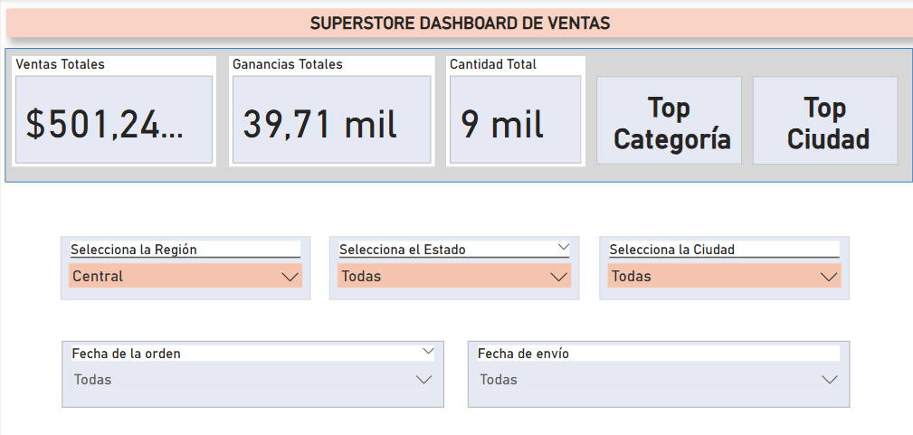

## 🛠️ Habilidades

# 📦 Superstore Dashboard – Análisis Comercial

Este proyecto presenta un dashboard interactivo desarrollado en Power BI con base en el dataset "Superstore". El objetivo es analizar el rendimiento comercial a través de ventas, ganancias, cantidades vendidas, envíos y tendencias geográficas, con el fin de ofrecer insights accionables para decisiones estratégicas.

---

## 🎯 Objetivos del análisis

- Evaluar el rendimiento comercial por categoría y subcategoría de producto.
- Identificar los productos más rentables y más vendidos.
- Analizar la tendencia del tiempo de entrega y los modos de envío más utilizados.
- Comparar ventas por región, estado y ciudad.
- Explorar patrones de comportamiento de clientes a lo largo del tiempo.

---

## 🧮 Datos utilizados

**Fuente:** Sample - Superstore (formato `.csv`)  
**Campos principales:**

- `Order Date` – Fecha del pedido  
- `Ship Date` – Fecha de envío  
- `Category`, `Sub-Category` – Tipo de producto  
- `Sales`, `Profit`, `Quantity` – Métricas financieras  
- `Region`, `State`, `City` – Ubicación geográfica  
- `Segment`, `Customer Name` – Tipo de cliente  

---

## 📊 Visualizaciones incluidas

- KPIs clave: ventas totales, ganancias, pedidos y tiempo promedio de envío  
- Gráfico de barras apiladas: análisis por categoría y subcategoría  
- Mapas de calor: productos más populares y más rentables  
- Segmentadores dinámicos: región, estado, ciudad y rango de fechas  
- Comparativo de modos de envío  

---

## 🛠️ Herramientas utilizadas

- Power BI Desktop  
- DAX para medidas personalizadas  
- Power Query para limpieza y transformación de datos  
- Diseño visual profesional y responsivo  

---

## 🧠 Principales insights

- Los segmentos "Corporate" y "Home Office" tienen patrones de compra distintos.  
- Algunos productos de bajo volumen tienen alta rentabilidad.  
- El modo de envío estándar representa el mayor volumen de pedidos, pero con tiempos de entrega más largos.  
- Hay ciudades con ventas altas pero ganancias negativas, lo que requiere ajuste de precios o logística.  

---

## 📷 Captura del dashboard

---

## 🙋‍♀️ Sobre mí

**Inés** – Consultora de negocios y analista de datos.  
Este proyecto forma parte de mi portafolio de visualización comercial con Power BI para demostrar cómo convertir datos en decisiones.

📩 Contacto: inesalarconscura@gmail.com
    Linkedin:www.linkedin.com/in/inesalarcon/

---
